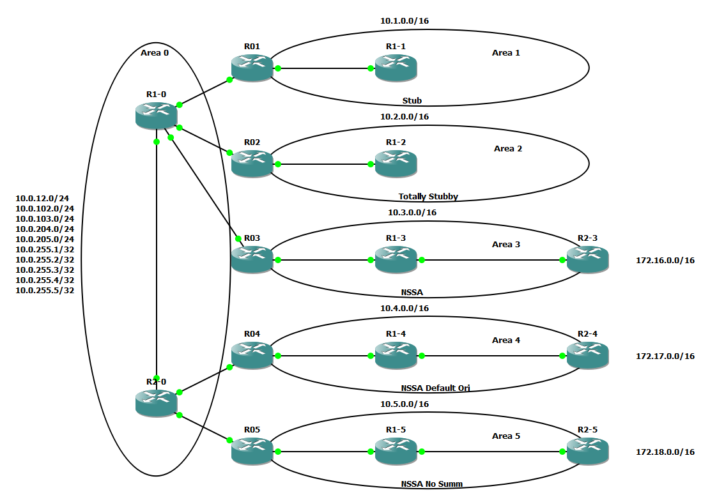

Project: 'OSPF Area Types Lab' created on 2022-02-04
Author: Greg <thespis@gmail.com>

This lab is inspired by this video:

https://www.youtube.com/watch?v=cM3OI_ZyRuQ

The initial config has OSPF adjacency for all areas, but the configurations for Stubby, Tottally Stubby, NSSA, NSSA Default Information Originate and Tottally NSSA are not configured.  A snapshot is provided for you to the this initial configuration. 

The external routes are just loopbacks and the command 'redistribute connected' were added to those routers with external routes.

I am using the IOU3 image.  I removed all interface modules but 1 to reduce the load this lab might generate.  The area 0 routers actually have 2 modules for a total of 8 ports.  Just in case you want to modify the topology.

Initial config has 96 routes.

!Topology
----

